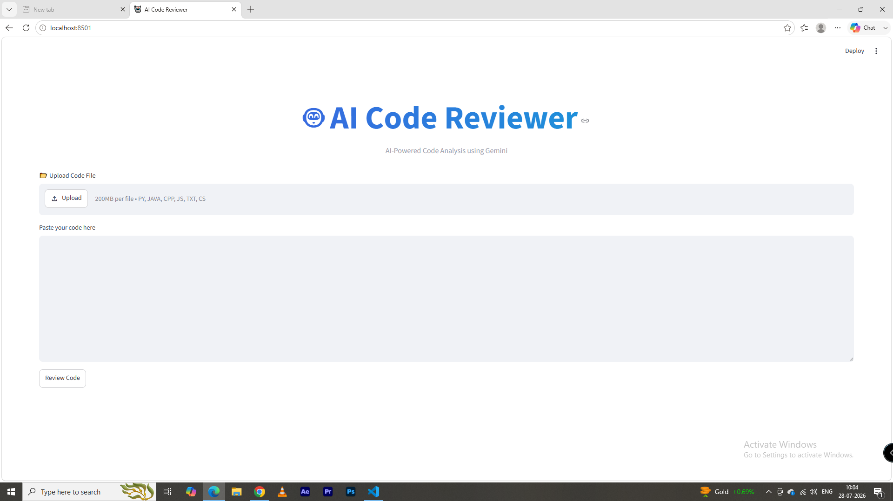
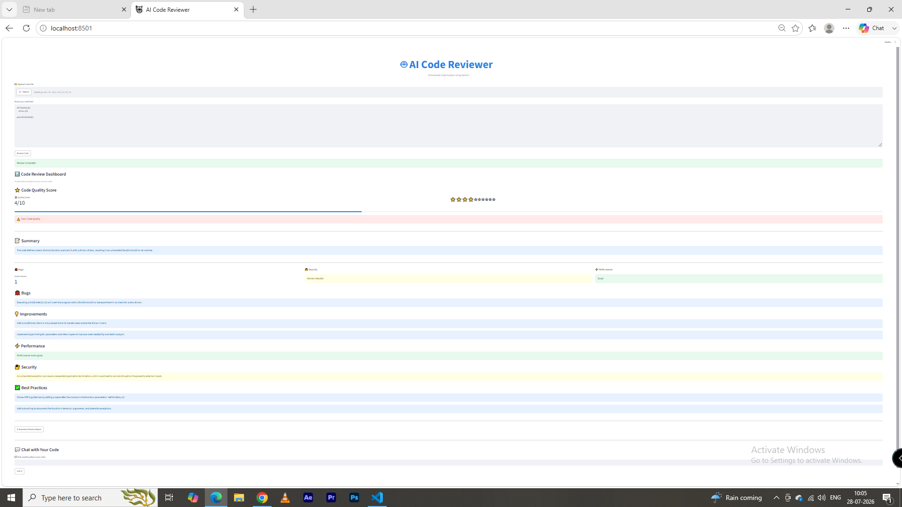
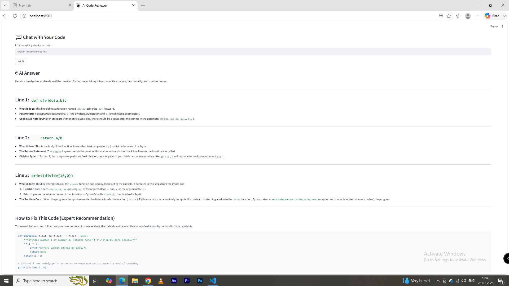
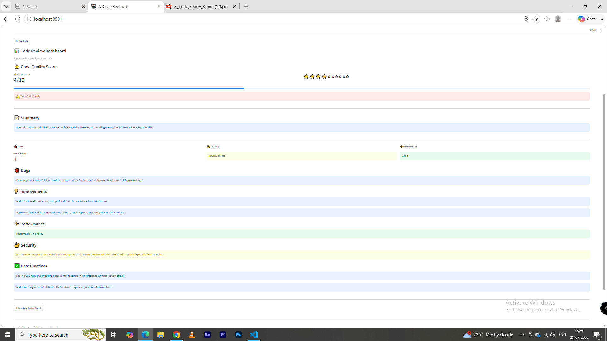
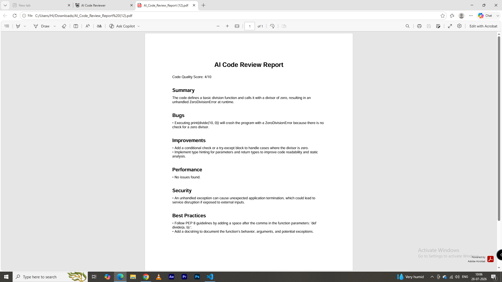

# 🤖 AI Code Reviewer

An AI-powered Code Reviewer built with **Streamlit** and **Google Gemini API**.

It allows users to upload or paste source code and receive an intelligent review including bug detection, security analysis, performance suggestions, best practices, a quality score, PDF report generation, and AI-powered code explanations.

---

## 🚀 Features

- 📂 Upload code files (.py, .java, .cpp, .js, .cs, .txt)
- ✍️ Paste code directly
- 🤖 AI-powered code review using Google Gemini
- ⭐ Code Quality Score (0–10)
- 🐞 Bug Detection
- 🔐 Security Analysis
- ⚡ Performance Suggestions
- ✅ Best Practices Recommendations
- 📄 Download PDF Review Report
- 💬 Chat with Your Code using AI

---

## 🌐 Live Demo

https://YOUR-STREAMLIT-APP.streamlit.app

## 🛠️ Tech Stack

- Python
- Streamlit
- Google Gemini API
- ReportLab
- python-dotenv

---

## 📦 Installation

Clone the repository:

```bash
git clone https://github.com/Yash-code22/AI-Code-Reviewer.git
```

Go into the project folder:

```bash
cd AI-Code-Reviewer
```

Install dependencies:

```bash
pip install -r requirements.txt
```

Create a `.env` file:

```env
GEMINI_API_KEY=YOUR_API_KEY
```

Run the application:

```bash
streamlit run app.py
```

---

## 📷 Screenshots

### Home Page


### Live App


### Chat with Code


### Code Review Dashboard


### PDF Report


---

## 👨‍💻 Author

**Yash Madan**

GitHub: https://github.com/Yash-code22
